# Projet Evenement ECF2 - ASP.NET avec Entity Framework

Ce projet utilise **ASP.NET Core** et **Entity Framework Core** pour gérer des événements, les participants, et les statistiques associées à ces événements. Il permet l'inscription des utilisateurs, la gestion des événements et le suivi des statistiques.

## Prérequis

Avant de commencer, assurez-vous d'avoir les éléments suivants installés sur votre machine :

- [.NET SDK](https://dotnet.microsoft.com/download) (version 6.0 ou supérieure)
- [SQL Server](https://www.microsoft.com/en-us/sql-server/sql-server-downloads) ou une autre base de données relationnelle supportée par Entity Framework
- [Visual Studio](https://visualstudio.microsoft.com/) ou [Visual Studio Code](https://code.visualstudio.com/) pour éditer le code

## Installation

1. **Cloner le dépôt :**

   Clonez le dépôt du projet depuis GitHub :

```bash
git clone https://github.com/Iradium59/ecf2.git
```

2. **Restaurer les dépendances :**

```bash
cd ecf2
dotnet restore
```

3. **Configurer la base de données :**

Ce projet utilise Entity Framework Core pour interagir avec la base de données. Configurer votre chaîne de connexion dans le fichier `appsettings.json`


4. **Créer la base de données :**

Une fois la chaîne de connexion configurée, vous pouvez générer la base de données en exécutant les commandes suivantes :

```bash
dotnet ef migrations add InitialCreate
dotnet ef database update
```

ou en ouvrant la console des package nuget et en tapant

```bash
Add-Migration InitialCreate
Update-Database
```


5. **Installer MongoDB**

Prérequis:
- [mongodb](https://docs.mongodb.com/manual/tutorial/install-mongodb-on-windows/)
- [mongosh](https://www.mongodb.com/docs/mongodb-shell/install/)


- Une fois les étapes éfféctué ajouter 2 variable d'environnement PATH
    - C:\Users<utilisateur>\AppData\Local\Programs\mongosh. Ajoutez le chemin d’accès obtenu pour mongosh.exe
    - C:\Program Files\MongoDB\Server<numéro_version>\bin

- Déterminer un répertoire pour le stockage des donnéee et créer un répertoire dans celui-ci

- Ouvrez un terminal et éxécuter la commande suivante : 

```bash
mongod --dbpath <chemin_du_repertoire>
```

- dans l'interpreteur de commande executer 

```bash
mongosh
```

- une fois dans l'invite de commande mongosh séléctionner la base de donnée
```bash
use <base de donnée name>
```


- Créer une collection `Stats`
```bash
db.createCollection('Stats')
```

- rendez vous dans le projet > appsetting.json
- modifier la connexion a mongodb si besoin


6. **lancer l'application**


## Fonctionnalités

- Gestion des événements : Création, modification et suppression des événements.
- Gestion des participants : Inscription des utilisateurs à un événement.
- Suivi des statistiques : Collecte des statistiques générées par les participants.


## Conception

### User Story
- John souhaite organsier un événement "course a pied"
- John souhaite pouvoir modifier la date et le lieu de son événements 
- John souhaite pouvoir supprimer son événements 
- Maria souhaite pouvoir s'inscrire a un événements
- Josh veut voir les statistiques des participants des derniers événements


### Diagrammes 

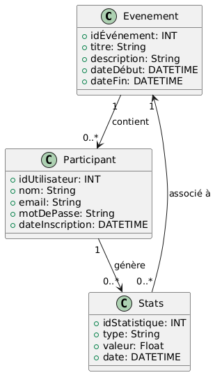


### Wireframe


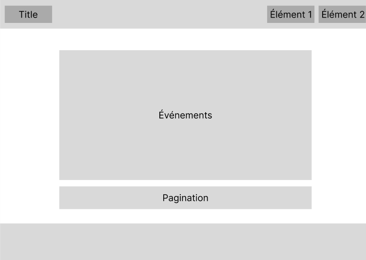
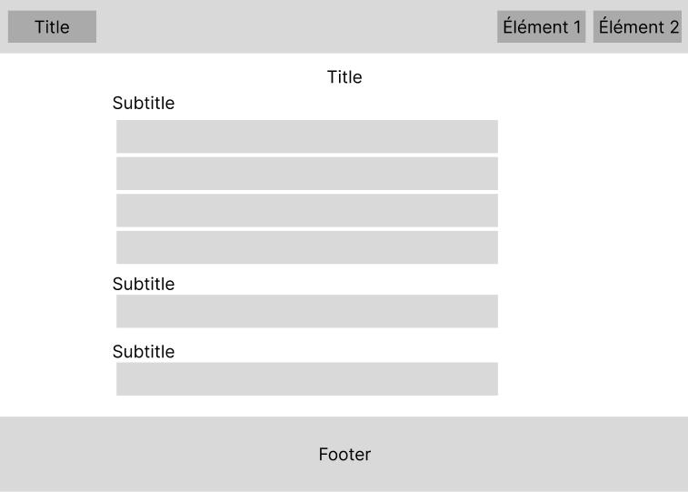
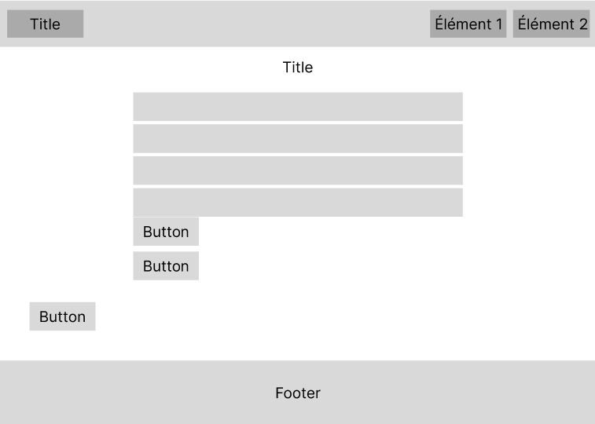
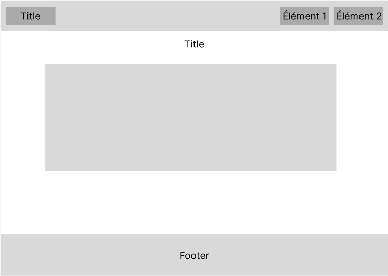
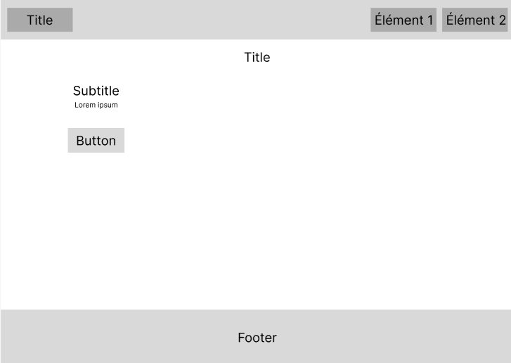


### Maquettes

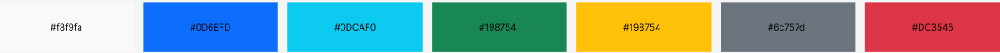
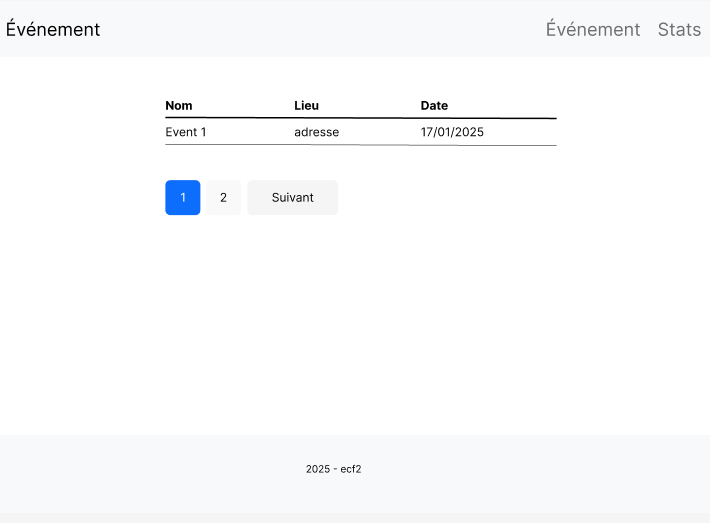
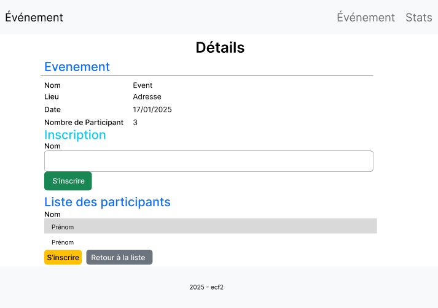
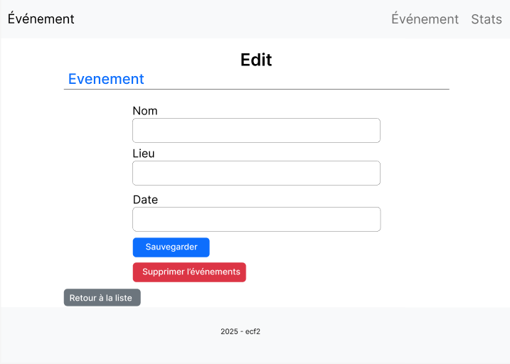
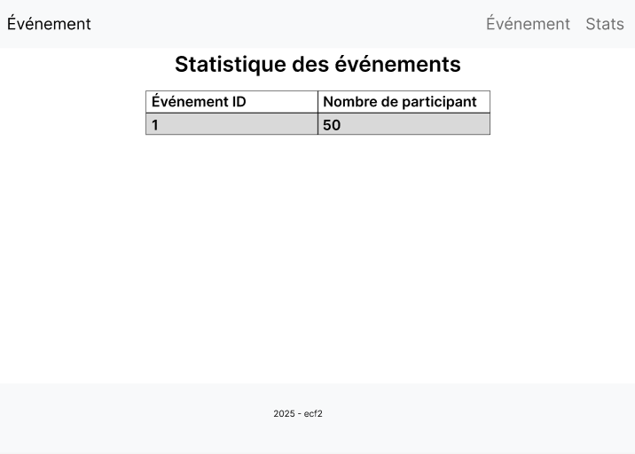
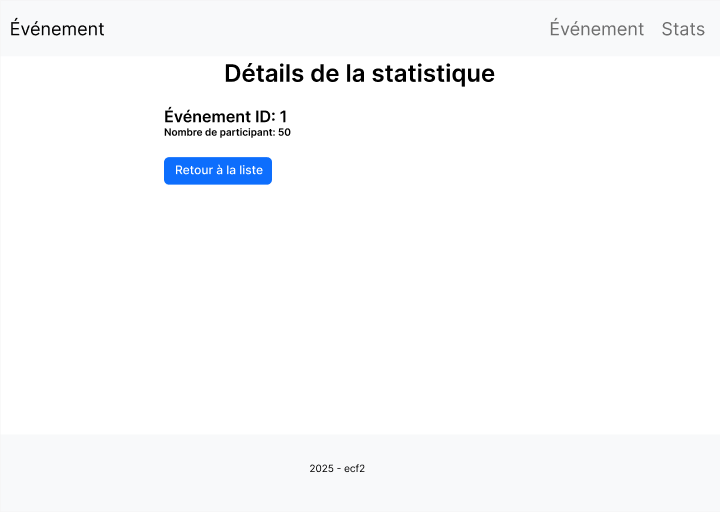


